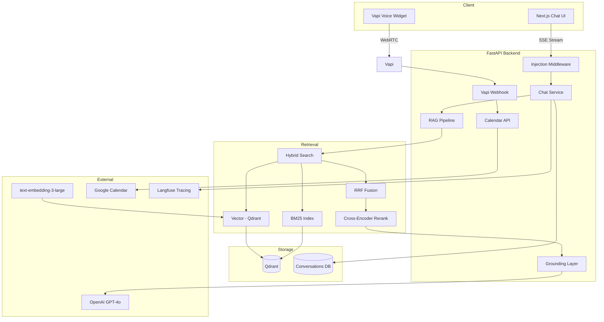

# System Architecture

## Overview

Production-grade AI representative that answers questions grounded in resume and GitHub data, books interviews via Google Calendar, and supports voice + chat interfaces.

## Data Flow: Question Answering

1. User sends message (chat or voice transcribed)
2. **Security layer** sanitizes input, blocks prompt injections
3. **Hybrid retrieval** queries all Qdrant collections (resume, readmes, commits, projects)
4. Vector search + BM25 run in parallel, fused via **Reciprocal Rank Fusion**
5. Top 10 candidates reranked by **bge-reranker-large** → Top 5
6. **Confidence score** computed from reranker score + semantic similarity + coverage
7. If confidence < threshold → refuse with standard message
8. Evidence wrapped in `<evidence>` tags (treated as data, not instructions)
9. GPT-4o generates answer with temperature 0.1
10. **Post-generation grounding check** flags unverified claims
11. Response streamed with citations and confidence score

## Data Flow: Interview Booking

1. User requests interview (chat or voice)
2. Agent asks for dates, name, email
3. `get_available_slots()` queries Google Calendar free/busy
4. Agent suggests slots within business hours
5. User confirms → `book_meeting()` creates event with Meet link
6. Confirmation sent to both attendees

## Collections (Qdrant)

| Collection | Source | Chunk Strategy |
|------------|--------|----------------|
| `candidate_resume` | PDF resume | Semantic 800/150 |
| `candidate_github_readmes` | README files | Semantic 800/150 |
| `candidate_commits` | Commit history | Per-commit 600 |
| `candidate_projects` | Repo metadata + issues | Semantic 600 |

## Anti-Hallucination Stack

| Layer | Mechanism |
|-------|-----------|
| Retrieval-only | No parametric knowledge for facts |
| Confidence gate | Refuse if score < 0.65 |
| Evidence wrapping | Documents marked as data |
| Low temperature | 0.1 for factual answers |
| Post-check | Verify claims against evidence |
| Injection defense | 20+ regex patterns blocked |

## Observability

- **Structlog**: JSON logs in production
- **Langfuse**: Trace retrieval → generation pipeline
- **Metrics API**: Query counts, refusal rates, latencies
- **Failure log**: Retrieval, hallucination, calendar, voice errors
